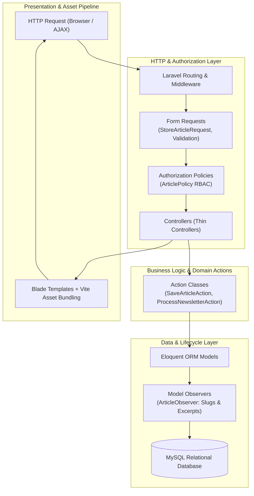

# PIMEL: Pedagogical Consulting Web Platform & Custom CMS

[](https://laravel.com/)
[](https://www.php.net/)
[](https://www.mysql.com/)
[](https://vitejs.dev/)
[]()
[](LICENSE)

> A full-stack web application and custom Content Management System (CMS) engineered with **Laravel 11** for pedagogical consultants, featuring dynamic multi-rubric blogging, asynchronous interactions, newsletter subscription filtering, and granular administrative controls.

---

## 📖 Overview & Product Vision

**PIMEL (*Pedagogia In Movimento*)** provides an all-in-one digital ecosystem tailored for pedagogical practitioners:
- **Public Engagement Portal:** A modern, accessible blog showcasing specialized articles, client consultation services, nested discussion threads, and topic-filtered newsletter subscriptions.
- **Custom Admin CMS:** A centralized back-office dashboard offering comprehensive CRUD operations, editorial workflow scheduling (Draft, Scheduled, Published, Archived), and comment moderation.

---

## 🖼️ Application Showcase

| Public Homepage | Blog Article View |
| :---: | :---: |
|  |  |

| Admin CMS Dashboard | Editorial Management |
| :---: | :---: |
|  |  |

---

## 🏛️ Architecture & Laravel Enterprise Best Practices

The platform is designed following strict separation of concerns, decoupling heavy business logic from HTTP Controllers:



### Architectural Highlights
- **Action Classes:** Complex business transactions (e.g. multi-step publication with notifications) are isolated into reusable single-responsibility Action classes.
- **Model Observers:** Automated generation of SEO-friendly URL slugs, reading time estimates, and summary excerpts on model lifecycle events.
- **Granular Policies:** Role-Based Access Control (RBAC) ensuring administrative boundaries are strictly validated.
- **Decoupled Validation:** `FormRequest` classes keep controllers minimal and clean.

---

## ✨ Feature Breakdown

### 🌐 Public Portal
- **Categorized Blog:** Multi-rubric filtering with sorting by popularity and publication date.
- **Asynchronous User Engagement:** AJAX-powered *"Like"* reactions and threaded/nested comment conversations.
- **Targeted Newsletter:** Granular topic selection during subscription for customized email digests.
- **Service Inquiries:** Integrated contact forms dispatching immediate transactional mail notifications.

### 🛡️ Admin CMS Panel
- **Complete Editorial Workflow:** Full CRUD with media uploading, status toggles (*Draft, Published, Scheduled, Archived*), and scheduled publishing.
- **Rubrics & Services Manager:** Dynamic creation and hierarchy management of blog categories and professional service offerings.
- **Moderation Queue:** Interactive dashboard to approve, flag, or delete community comments.

---

## 🛠️ Tech Stack

- **Framework:** Laravel 11.x
- **Language:** PHP 8.2+
- **Database:** MySQL 8.x / MariaDB (managed via Migrations, Seeders & Factories)
- **Asset Compilation:** Vite & modern CSS/JS
- **Authentication:** Laravel Session Authentication & Gates/Policies

---

## 🚀 Quickstart & Setup Guide

### 1. Clone & Install Dependencies
```bash
git clone https://github.com/hidemet/laravel-pedagogical-blog-platform.git
cd laravel-pedagogical-blog-platform

# Install PHP dependencies
composer install

# Install Node frontend dependencies
npm install
```

### 2. Environment Configuration
```bash
# Duplicate environment file
cp .env.example .env

# Generate application encryption key
php artisan key:generate
```

### 3. Database Migration & Seeders
Configure your MySQL database credentials in `.env`, then run:
```bash
php artisan migrate --seed
php artisan storage:link
```

### 4. Run Development Servers
```bash
# Terminal 1: Vite asset watcher
npm run dev

# Terminal 2: Local PHP server
php artisan serve
```
Visit `http://127.0.0.1:8000` in your browser.

---

## 📄 License

Released under the [MIT License](LICENSE).
